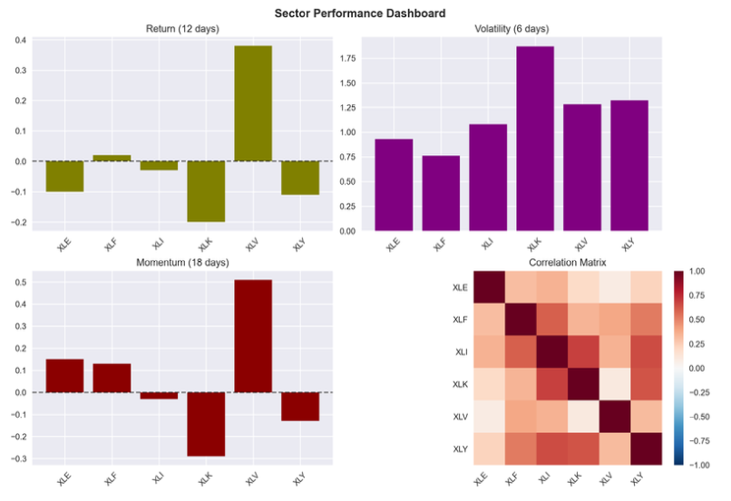
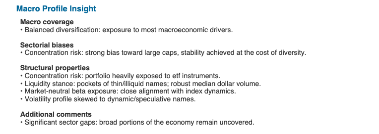
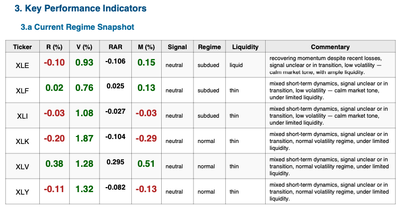

## Table of Contents

- [**Portfolio Rotation Engine**](#portfolio-rotation-engine)
  - [**Core Objectives**](#core-objectives)
  - [Why This Project Matters](#why-this-project-matters)
  - [Disclaimer](#disclaimer)
  - [How to Run the Project](#how-to-run-the-project)
    - [1. Clone the repository](#1-clone-the-repository)
    - [2. Create a virtual environment](#2-create-a-virtual-environment)
    - [3. Install dependencies](#3-install-dependencies)
    - [4. Generate a report](#4-generate-a-report)
  - [**Methodology Overview**](#methodology-overview)
    - [**1. Data Ingestion**](#1-data-ingestion)
    - [**2. Feature Extraction**](#2-feature-extraction)
    - [**3. Profiling Engine**](#3-profiling-engine)
    - [**4. Scenario Engine**](#4-scenario-engine)
    - [**5. Report Generation**](#5-report-generation)
  - [**Expected Outputs**](#expected-outputs)
  - [Validation \& Stress Testing](#validation--stress-testing)
    - [Full Backtest Summary (30 pages)](#full-backtest-summary-30-pages)
  - [How to Read \& Interpret the Report](#how-to-read--interpret-the-report)
  - [Example Outputs](#example-outputs)
    - [1. Sector Performance Dashboard](#1-sector-performance-dashboard)
    - [2. Macro Profile Insight](#2-macro-profile-insight)
    - [3. KPI Snapshot](#3-kpi-snapshot)
  - [**Tools \& Libraries**](#tools--libraries)
  - [**Author**](#author)
  - [About the Author](#about-the-author)


# **Portfolio Rotation Engine**
**Dynamic Cross-Asset Analysis • Multi-Frequency Signals • Automated Financial Reporting (PDF)**

The **Portfolio Rotation Engine** is a dynamic, adaptive analytics system designed to evaluate assets across equities, ETFs, crypto, and forex through a unified multi-layer signal-processing pipeline.

Unlike traditional sector-rotation backtests, this engine produces **context-aware diagnostics**, **risk assessments**, **momentum structures**, and **volatility regime detection** at any frequency (daily, weekly, monthly).

It automatically generates a full financial report (PDF) including metrics, visualizations, interpretations, and scenario-based insights.

---

## **Core Objectives**

The engine is built to:

- Process heterogeneous asset classes (stocks, ETFs, crypto, forex).
- Adapt dynamically to frequency constraints and observation depth.
- Compute short-term and long-term indicators (returns, volatility, momentum).
- Detect volatility regimes (subdued → turbulent).
- Infer behavioral profiles (defensive, dynamic, speculative, high-beta…).
- Generate a structured PDF report with charts, diagnostics, and commentary.
- Provide stable, interpretable signals even in noisy or incomplete markets.

The system remains robust under **low liquidity**, **data gaps**, **flash-crash effects**, and **young tickers with limited history**.

---

## Why This Project Matters

This project was designed as a **neutral, systematic analysis engine** — not as a trading model, and not as an investment recommender.

Its purpose is similar to producing a **“medical file” for each asset**:  
a clear, structured, repeatable assessment of its recent behavior, risk profile, volatility regime, and momentum structure.

In modern portfolio teams, analysts must be able to:

- Process large volumes of heterogeneous market data  
- Extract factual, noise-resistant indicators  
- Detect regime changes (volatility shifts, momentum breaks, liquidity degradation)  
- Summarize complex dynamics into **objective diagnostics**  
- Deliver outputs that enhance **human decision-making**, not replace it  
- Automate reporting at scale with consistent quality  

This engine demonstrates all these abilities.

It produces **automated, professional PDF reports** that present:

- factual metrics (returns, volatility, drawdown exposure)  
- multi-frequency signals (short-term / long-term momentum)  
- regime classification (subdued → turbulent, defensive → speculative)  
- stress scenarios when data is incomplete or inconsistent  

No prediction.  
No recommendation.  
Just **structured, interpretable insights** that help a portfolio manager or analyst form a better judgment.

This aligns with real workflows in **portfolio analytics, risk management, and systematic research**, where delivering clean, reproducible insights matters more than forecasting.

## Disclaimer

This project is for **educational and informational purposes only**.  
It does **not** provide investment advice, trading signals, or financial recommendations.

All analytics, indicators, and reports generated by the engine are purely **descriptive** and should 
not be interpreted as predictions of future performance.

The project’s purpose is to demonstrate skills in **data engineering, quantitative analysis, and 
automated reporting**, not to support real-world investment decisions.

```md
## Project Structure

factor-rotation/
├─ data/
│  ├─ raw/            # User-managed inputs (e.g., enriched tickers CSV)
│  └─ processed/      # Parquet data downloaded + cleaned by the engine
├─ notebooks/         # Exploratory analysis, validation, prototypes
├─ src/               # Core engine (data ingestion, indicators, profiling, report builder)
├─ report/
│  ├─ backtests/      # Scenario-specific stress and validation tests
│  └─ outputs/        # Generated PDF reports
├─ tests/             # (Reserved) future unit tests
├─ requirements.txt
└─ README.md
```
---

## How to Run the Project
> This project requires **Python 3.10+**
>
> 
### 1. Clone the repository

```bash
git clone https://github.com/benjaminkhelifa/factor-rotation.git
cd factor-rotation
```

### 2. Create a virtual environment

```bash
python3 -m venv .venv
# macOS / Linux
source .venv/bin/activate
# Windows activation
.\venv\Scripts\activate
```

### 3. Install dependencies

```bash
pip install -r requirements.txt
```

### 4. Generate a report

```bash
python src/report_builder.py
```
```
The generated PDF will appear in:

```
report/outputs/
```


```
## **Methodology Overview**

### **1. Data Ingestion**
- Automatic download from Yahoo Finance  
- Cleaning & resampling  
- Frequency inference  
- Parquet caching for reproducibility  

### **2. Feature Extraction**
- Multi-horizon returns  
- Volatility signatures  
- Momentum curvature (ST/LT consistency)  
- Stress metrics (ΔReturn, Volatility Ratio, Momentum Ratio)  

### **3. Profiling Engine**
- Liquidity buckets (very_liquid → illiquid)  
- Beta-driven and market-cap classification  
- Dynamic vs defensive behavioral profiles  
- Volatility regimes (subdued → turbulent)  

### **4. Scenario Engine**
- Cross-dimensional consistency checks  
- Fallback logic when signals conflict  
- Robustness to anomalies, jumps, and missing data  

### **5. Report Generation**
- Automated PDF including:
  - KPI tables  
  - Momentum & return charts  
  - Rotation metrics  
  - Macro-profile inference  
  - Auto-generated commentary blocks  

---

## **Expected Outputs**

- Clean structured datasets (`data/processed/...`)
- Diagnostic tables (returns, risk, ratios)
- Visualizations (momentum curves, volatility regimes, long/short mismatch)
- Fully automated analytical PDF reports
- Stress tests & backtests under multiple scenarios

## Validation & Stress Testing

To ensure that the engine is not only functional but **reliable under real-world market conditions**,  
I conducted a structured campaign of **32 backtests across 26 distinct scenarios**.

These scenarios included:

- high-volatility periods  
- low-liquidity environments  
- structural breaks and macro shocks  
- incomplete or irregular datasets  
- noise-injected price series  
- abnormal momentum reversals and outliers  

The goal was not to “optimize performance,” but to **validate system resilience**:

- indicators remain stable across heterogeneous market conditions  
- volatility and momentum regimes behave coherently even with noisy inputs  
- fallback logic correctly handles missing or inconsistent data  
- the PDF generator stays structurally sound regardless of scenario quality  
- rotations and signals maintain interpretability under stress  

This testing phase ensured the engine behaves consistently and predictably when market data does *not*.

### Full Backtest Summary (30 pages)

If you want a deeper look at the methodology, the scenarios, and the conclusions,  
you can read the complete technical report here:

👉 EN — **[Download Backtest Review (PDF)](<report/Backtest/EN_Backtest Summary.pdf>)**

👉 FR —  **[Téléchargez le compte rendu backtest (PDF)](<report/Backtest/FR_Backtest Summary.pdf>)**


This document details:

- scenario design  
- validation methodology  
- robustness checks  
- anomalies encountered & how the engine handled them  
- insights on indicator stability  
- limitations and possible improvements  

It serves as the formal technical backbone of the project.

## How to Read & Interpret the Report

For full transparency and reproducibility, the project includes a
23-page appendix detailing:
	•	all indicator formulas (Return, Volatility, Momentum, RAR, ratios…)
	•	dynamic window system (frequency-aware calibration)
	•	scenario logic (13 CT configurations)
	•	volatility regime classification
	•	scaling factors by asset class
	•	glossary of all technical terms
	•	interpretation methodology for each table, chart, and regime

This annex explains exactly how to read the generated PDF reports and
how every diagnostic is computed and interpreted.

👉 Download the Annex (PDF):

EN — **[Annex — How to read the report (PDF)](<report/EN_Annex_How_to_read .pdf>)**

FR —  **[Annexe comment lire le rapport (PDF)](<report/FR_Annex_How_to_read.pdf>)**

## Example Outputs

Below are sample visuals automatically generated by the reporting engine.

### 1. Sector Performance Dashboard
A composite view showing short-term returns, volatility, momentum, and a correlation matrix.

In the full report, the engine also extracts **Top Positive / Neutral / Negative correlations** using
adaptive clustering buckets, allowing a quick understanding of dependency structures between assets.



### 2. Macro Profile Insight

The **Macro Profile Insight** section provides a structural analysis of the portfolio based on the 
composition of the selected tickers. It evaluates whether the group of assets forms a balanced 
exposure or reveals structural vulnerabilities.

This module automatically analyzes:

- **Sector distribution** – Detects concentration risk and highlights overexposed themes.
- **Market-cap coverage** – Identifies whether the portfolio captures a broad spectrum of company 
  sizes or is biased toward a specific capitalization range.
- **Liquidity profile** – Flags potential liquidity constraints when tickers exhibit thin volume, 
  making entries or exits more difficult.
- **Systematic risk orientation (beta)** – Shows whether the portfolio leans toward defensive or 
  high-beta assets.
- **Volatility balance** – Indicates whether risk is evenly distributed or skewed across holdings.
- **Missing macro themes** – Warns when large segments of the economy are not represented, reducing 
  diversification.

This analysis is most relevant when evaluating **a real portfolio with equal or weighted allocation**. 
When used on an arbitrary group of unrelated tickers, the module still executes normally, but its 
purpose is primarily to detect **structural imbalances**, not to interpret individual asset performance.

All insights are generated automatically from the tickers’ metadata and computed risk features — no 
manual input is required.




### 3. KPI Snapshot
The **Macro Profile Insight** table provides a deeper, structured interpretation of the asset's 
behavior. It aggregates key indicators into actionable labels that help assess signal quality and 
market conditions:

- **RAR (Risk-Adjusted Return)** – A return metric normalized by volatility, offering a clearer view of 
  performance relative to risk exposure.
- **Signal** – A synthetic consistency flag evaluating whether short-term returns, volatility, and 
  momentum tell a coherent story.  
  When signals diverge, the engine marks the asset as *“unclear / transition”*, indicating that 
  recent movements should not be trusted.
- **Regime** – A volatility-state classifier comparing short- vs long-term volatility structures.  
  A *subdued* regime suggests stabilizing volatility, strengthening confidence in current trends.
- **Liquidity label** – A quick assessment of how easily the position can be entered or exited, based 
  on dollar volume and market participation.
- **Dynamic commentary** – Automatically generated text describing market tone, liquidity conditions, 
  and short-term behavior, based entirely on computed indicators and profile labels.

This table provides a compact, human-readable diagnostic that extends far beyond raw KPIs and is 
fully generated by the engine with no manual intervention.



Curious what the engine produces?

You can download a real example generated by the system here:

👉 [Download Example Report (PDF)](report/Backtest/Backtest%20reports/example_sector_report.pdf)

## **Tools & Libraries**

- Python 3.10+
- pandas, numpy  
- matplotlib  
- yfinance  
- reportlab  

---

## **Author**

**Benjamin Khelifa**  
Project start: **September 2025**  
Scope: *Dynamic multi-asset rotation engine & analytical reporting system*

---
## About the Author

My name is **Benjamin Khelifa**, I'm a financial analyst specialized in
data-driven workflows, quantitative indicators, and automated reporting
systems.

I built this project during the transition period preceding my **Canadian
Permanent Residency**, as a way to demonstrate my technical capabilities and
my approach to market analysis.  
Rather than producing a traditional academic backtest, I focused on creating
a **robust, adaptable, multi-asset engine** that reflects how I structure
problems, validate assumptions, and engineer clean analytical pipelines.

This repository is therefore both a technical deliverable and a professional
statement:  
I value clarity, reproducibility, and rigorous design — especially when
markets become noisy or data quality is imperfect.

If you'd like to connect:
- **LinkedIn**: *https://www.linkedin.com/in/bkhelifa/*